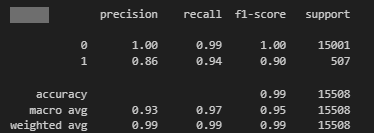
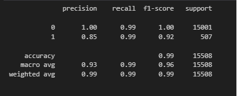

# Credit_Risk_Classification
## Overview of the Analysis
The goal here is to build and test machine learning models to predict loan risk. We're using a dataset from a peer-to-peer lending company to create a model that can tell us whether borrowers are creditworthy or risky.

In this dataset, we're looking at various financial details like loan size, interest rate, borrower income, and more to predict whether a loan is healthy or has a high risk of default.

We split the data into training and testing sets, then use a logistic regression model to make predictions. Since there are way more healthy loans than risky ones, we use a technique called RandomOverSampler to balance out the data before fitting it into the model.

After fitting the model, we evaluate its performance by looking at accuracy scores, confusion matrices, and classification reports. This helps us understand how well the model is doing at predicting both healthy and risky loans.

## Results

This section describes the accuracy and balanced accuracy scores, and the precision and recall scores of the two machine learning models used for the acitivity:

* Machine Learning Model 1 - **Logistic Regression**:
  

The model shows good performance in predicting both healthy and high-risk loans, with an accuracy score of 99.3% and a balanced accuracy score of 96.6%.
However, it's important to note that the data is imbalanced, with 96 % of loans being healthy.
For healthy loans, the precision score is 100%, meaning they were always classified correctly. For high-risk loans, the precision is 86%, indicating some misclassifications.
The recall score for healthy loans is 99%, suggesting that most healthy loans were correctly identified. For high-risk loans, the recall is 94%, indicating some were missed.

* Machine Learning Model 2 - **RandomOverSampler**:
   

This model performs even better, with an accuracy score of 99.4% and a balanced accuracy score of 99.4%.
Like the first model, it also has 100% precision for healthy loans but slightly lower at 85% for high-risk loans.
However, the recall scores are impressive, with 99% for both healthy and high-risk loans, meaning almost all loans were correctly classified.
Overall, while both models perform well, the RandomOverSampler model outperforms the Logistic Regression model, especially in correctly identifying high-risk loans.

## Summary

Based on the results, here are some important points:

The model created with random oversampling performs better, showing higher accuracy and balanced accuracy compared to the logistic regression model with oversampled data.
The random oversampling method excels in correctly identifying loans, especially high-risk ones (labeled as '1'), resulting in higher recall scores. This is crucial for lending companies, as correctly identifying high-risk loans helps reduce defaults and improves overall profitability.
Considering these factors, I recommend using the RandomOverSampler method to rebalance the data due to the imbalance towards healthy loans. Then, apply logistic regression, as this approach yields better accuracy and recall scores, which are vital for lending companies when making decisions.
